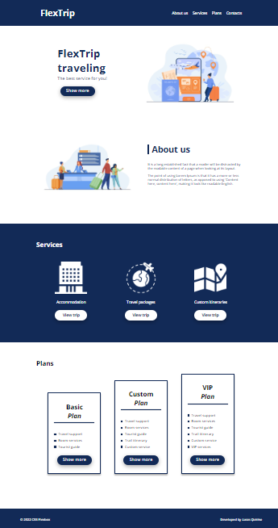

# Making a single page design CSS FlexBox
## Hello guys!

In this activity some concepts of FlexBox, positioning, spacing, flex-items and flex-container were trained.

 

The technologies worked were:

 

* HTML5
* CSS 3
* CSS FlexBox
* Git/GitHub

 

