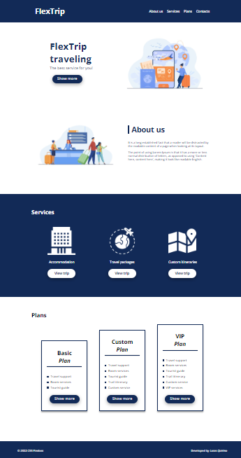

<h1 align="center">Projeto prático utilizando FlexBox. <h2>

<h4 align="left">- Projeto prático para os Bootcamps da Digital Innovation One - DIO para o curso  "Posicionando elementos com Flexbox em CSS - Desafio integrador".</h3>

  

